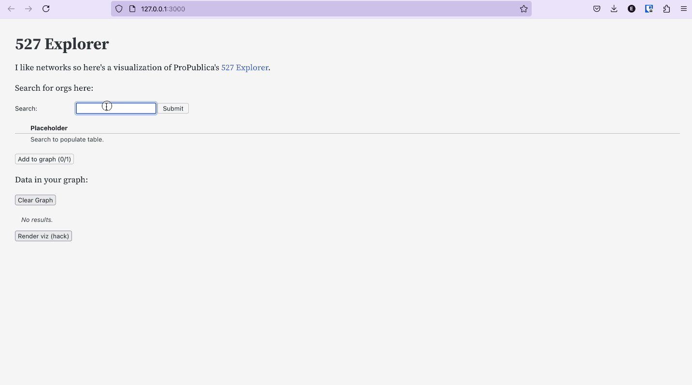

# 527 Explorer

Network visualization of ProPublica's [527 Explorer](https://projects.propublica.org/527-explorer/), built with [Observable Framework](https://observablehq.com/platform/framework).

## Demo

## Features

This is not finished but the basics are in place.
- [x] Search by organization name.
- [x] Pick organizations to visualize.
- [x] Fetch "ego network" of each org's contributors and expenses.
- [x] Combine sub-networks and visualize.
- [ ] Add placeholder while waiting for in-flight requests.
- [ ] Add contributions / expenses tab to "data in your graph" table.
- [ ] Fix nodes flying off the page.
- [ ] Search by EIN, contributor, expenditure name.
- [ ] Fetch lots more data without pissing off devs. Need 1000s of transactions for core-periphery to emerge and plotting to become an issue.

## Why make this?

This project is in part, an extension of my prior research into nonprofit donations networks. 

I would like to write my own opinionated d3.js layout that deals with the scale-free and core-periphery characteristics of these networks. Having code to query and visualize a donations dataset was a first step.

I also have ambitions to create better looking interactive visualizations, and was curious by the interactivity provided by Observable.
